# Go Backend Combat — Posters

Эта серия плакатов — не набор шпаргалок, а единая карта инженерного мышления backend-разработчика. Каждый следующий плакат добавляет новый уровень к предыдущему: сначала мы учимся принимать инженерное решение, затем выражать его средствами Go, управлять concurrency, разделять ответственности, сохранять корректное состояние, работать через сетевые границы и наконец собирать всё в полноценный backend.

Плакаты лучше рассматривать последовательно. На каждом листе важно не столько запоминать отдельные термины, сколько понимать причинную связь: какое требование мы выполняем, какой invariant сохраняем, где проходит boundary, какой механизм выбираем, что произойдёт при отказе и каким наблюдаемым сигналом мы подтвердим результат.

- [Go Backend Combat — Posters](#go-backend-combat--posters)
  - [01. ENGINEERING MINDSET](#01-engineering-mindset)
  - [02. GO LANGUAGE](#02-go-language)
  - [03A. CONCURRENCY MODEL](#03a-concurrency-model)
  - [03B. CONCURRENCY RUNTIME](#03b-concurrency-runtime)
  - [03C. CONCURRENCY ENGINEERING](#03c-concurrency-engineering)
  - [04A. SOLID](#04a-solid)
  - [04B. DESIGN ENGINEERING](#04b-design-engineering)
  - [05A. DATA MODEL](#05a-data-model)
  - [05B. SQL SCHEMA](#05b-sql-schema)
  - [05C. TRANSACTIONS \& CONCURRENCY](#05c-transactions--concurrency)
  - [06A. DISTRIBUTED MODEL](#06a-distributed-model)
  - [06B. DELIVERY \& MESSAGING](#06b-delivery--messaging)
  - [06C. FAILURE \& EFFECTS](#06c-failure--effects)
  - [07A. HTTP API](#07a-http-api)
  - [07B. APPLICATION ARCHITECTURE](#07b-application-architecture)
  - [07C. RUNTIME \& CACHE](#07c-runtime--cache)

---

## 01. ENGINEERING MINDSET

Backend-разработка начинается не с выбора технологии. Сначала нужно понять, что система должна делать и как будет выглядеть корректный результат. Требование должно быть сформулировано так, чтобы его можно было наблюдать и проверить. Фраза «система должна быть удобной» почти бесполезна, пока не уточнено, что именно означает удобство и какие признаки позволят считать требование выполненным.

Следующий уровень — invariant. Это свойство, которое должно сохраняться независимо от конкретного сценария выполнения. Например, состояние Job должно иметь допустимое значение, изменение состояния должно иметь понятную причину и владельца, а ошибка не должна случайно приводить к неконтролируемому побочному эффекту. Инженер смотрит не только на happy path, но и на то, что произойдёт при отказе, повторе, timeout и конкуренции.

После этого нужно провести boundary. Не следует начинать с названий каталогов и шаблонов архитектуры. Сначала нужно спросить, какие части системы должны изменяться независимо. Именно там обычно появляется полезная граница ответственности. В Go такими границами могут быть тип, функция, package, interface или отдельный infrastructure adapter.

Далее выбирается mechanism. Здесь особенно важно не перепутать инструмент с целью. `interface` нужен не «для абстракции», а когда consumer должен зависеть от поведения, а не от конкретной реализации. `goroutine` нужна не потому, что Go её предоставляет, а потому что часть работы должна выполняться независимо. `context` нужен для cancellation и deadline. Каждый механизм должен быть обоснован той гарантией, которую он обеспечивает.

Последний вопрос — evidence. Слова «я проверил» недостаточно. Нужен воспроизводимый сигнал: тест, race detector, benchmark, integration check, metric, log или trace. При этом каждый сигнал доказывает только определённый набор свойств. Зелёный unit test не доказывает отсутствие distributed failure, а успешный benchmark не доказывает correctness.

Полный инженерный цикл поэтому выглядит как дисциплина мышления: уточнить требование, определить invariant, провести boundary, выбрать минимальный механизм, определить failure behavior и получить evidence. Такой способ рассуждения полезнее любого отдельного framework или pattern.

---

## 02. GO LANGUAGE

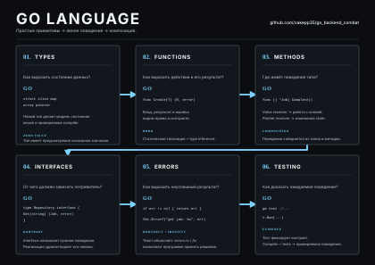

Go хорошо воспринимается, когда язык рассматривают не как коллекцию ключевых слов, а как небольшое число сильных примитивов. Состояние выражается типами. `struct` объединяет связанные данные и делает модель явной. Собственные типы вроде `JobStatus` добавляют смысл обычным значениям и помогают сделать неправильное состояние труднее выразить. Хороший тип не просто хранит данные — он делает контракт программы понятнее.

Functions выражают действия и их результаты. Go сознательно делает результаты явными: функция может вернуть несколько значений, а ошибка обычно является обычным return value. Это создаёт очень прямую модель взаимодействия между вызывающим и вызываемым кодом. Вместо скрытого control flow через исключения программа явно показывает, какой результат получен и какая ошибка возникла.

Methods связывают поведение с типом, которому оно принадлежит. Это особенно удобно для domain types. `Job` может знать, как определить, завершена ли задача, или изменить своё состояние. При этом нужно понимать value и pointer semantics. Value receiver работает со значением, pointer receiver позволяет работать с исходным состоянием. Выбор receiver определяется смыслом операции, а не механическим правилом.

Slice и map отвечают на разные задачи. Slice представляет последовательность элементов и имеет длину и capacity. `append` может вернуть новый slice, поэтому результат нужно использовать. Map выражает доступ по ключу и возвращает не только значение, но и признак существования ключа. Это даёт особенно характерный для Go контракт `value, ok`.

Interfaces описывают необходимое поведение. В Go не нужно отдельно объявлять `implements`: тип автоматически удовлетворяет interface своим method set. Поэтому consumer может определить маленький контракт, а concrete implementation просто соответствует ему. Это хорошо сочетается с dependency inversion и позволяет менять infrastructure detail без изменения policy.

Ошибки являются частью API. Полезно различать текст ошибки и её identity. Текст объясняет проблему человеку, а sentinel или typed error позволяет программе принять решение. `%w` позволяет добавлять контекст, сохраняя исходную error identity. Такой подход особенно хорошо масштабируется по границам приложения.

Последний фундаментальный элемент — testing. Тест должен фиксировать observable behavior, а не случайное внутреннее устройство. Для похожих случаев в Go естественны table-driven tests. В результате язык образует очень компактную модель: types выражают состояние, functions — действия, methods — поведение, interfaces — необходимые контракты, errors — неуспешный результат, tests — evidence.

---

## 03A. CONCURRENCY MODEL

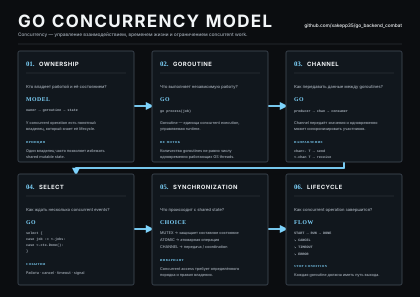

Concurrency начинается с ownership. Если программа создаёт goroutine, должно быть понятно, кто отвечает за её запуск, ресурсы, состояние и завершение. Goroutine без владельца и stop condition быстро превращается в источник утечек, зависаний и трудно объяснимого поведения.

`go f()` создаёт goroutine, но само по себе не гарантирует, что работа будет завершена. Завершение `main` завершает процесс, поэтому отдельную проблему составляет ожидание результатов. `WaitGroup` решает именно задачу ожидания: он позволяет зарегистрировать work и дождаться, пока все зарегистрированные operations закончатся. Он не выполняет cancellation и не является очередью.

Channel нужен, когда между concurrent operations требуется передача данных или координация. Unbuffered channel связывает sender и receiver во времени: отправка ожидает соответствующего приёма. Buffered channel позволяет producer некоторое время опережать consumer, но только до заданной capacity. Это делает buffer инструментом управления нагрузкой, а не бесконечным storage.

`select` позволяет ждать несколько событий одновременно. Для backend worker типична ситуация, когда он ждёт либо новую Job, либо cancellation. Так worker получает одновременно механизм работы и механизм завершения.

Shared mutable state требует отдельной дисциплины. Если две goroutines одновременно изменяют одну memory location, нужно определить, как сохраняется invariant. Для этого могут использоваться mutex, atomic или передача ownership через channel. Выбор зависит от модели состояния, а не от предпочтений автора.

Наконец, каждая concurrent operation должна иметь lifecycle. Она должна стартовать, выполнять работу, реагировать на cancellation или другой stop condition и завершаться. Вся остальная concurrency-модель строится вокруг этих четырёх вопросов: кто владеет работой, кто владеет state, как происходит coordination и какое событие означает `DONE`.

---

## 03B. CONCURRENCY RUNTIME

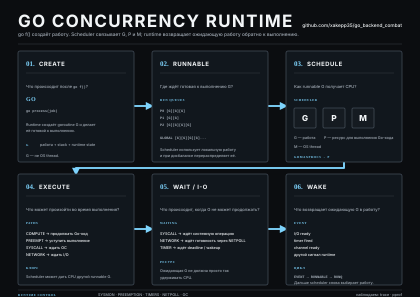

Чтобы понимать производительность Go, полезно иметь упрощённую модель runtime. После `go f()` появляется goroutine, которая становится runnable. Runnable work должна быть помещена в очередь, откуда scheduler сможет выделить её на выполнение.

Здесь появляется GMP. G — goroutine, то есть сама работа. M — OS thread, на котором фактически выполняется Go code. P — runtime resource, необходимый scheduler для исполнения Go code. Это не последовательность «G превращается в P и затем в M». Это разные runtime entities, которые scheduler связывает между собой.

Runnable goroutines находятся в scheduler run queues. Часть работы организована локально вокруг P, при этом существует механизм глобального распределения и балансировки. Когда execution resource освобождается, scheduler выбирает следующую runnable goroutine. Если workload распределён неравномерно, runtime может перераспределять работу между P.

Goroutine не обязательно всё время выполняет CPU code. Она может быть вытеснена scheduler, ждать syscall или ждать network I/O. Для сетевого ввода-вывода runtime использует netpoller, чтобы ожидание готовности network operation не превращалось просто в бесполезное удержание CPU. Когда I/O становится готовым, связанная goroutine снова может стать runnable и вернуться в scheduler flow.

Эта модель полезна именно для reasoning. Когда система медленная, можно задавать конкретные вопросы: слишком много runnable work, слишком высокая CPU load, блокировка на I/O, contention, backlog или saturation downstream. GMP не заменяет benchmarks и profiling, но помогает понимать, что именно происходит с concurrent work внутри runtime.

---

## 03C. CONCURRENCY ENGINEERING

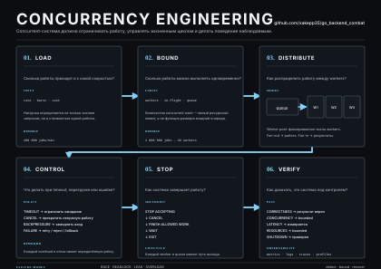

Concurrency в production начинается с нагрузки, а не с числа goroutines. Нужно понимать rate, burst и стоимость одной операции. Тысяча дешёвых операций и тысяча операций, каждая из которых занимает значительный CPU, memory или downstream capacity, — совершенно разные нагрузки.

После оценки нагрузки вводится bounded concurrency. Количество workers, in-flight operations, queue capacity и database connections не должно расти прямо пропорционально входному объёму работы. Ограничение ресурсов — это гарантия, а не оптимизационная мелочь.

Здесь появляется backpressure. Если producer способен создавать сто задач в секунду, а consumer обрабатывает только десять, система должна заставить producer учитывать эту разницу. Это может быть blocking, bounded queue, rejection, throttling или другой явно выбранный policy. Главное — не выдавать producer бесконечный кредит памяти.

Worker pool выражает эту модель очень прямо: несколько workers получают work из ограниченной очереди. Это позволяет отделить объём поступившей работы от числа одновременно выполняемых operations. Channel даёт передачу work, WaitGroup — ожидание lifecycle, context — cancellation.

Но bounded concurrency действует не только внутри Go. Database connection pool — ещё одна ресурсная граница. Даже если в системе сто goroutines, PostgreSQL может обслуживать только ограниченное число одновременно занятых connections. Аналогичная логика относится к Redis, Kafka, внешним HTTP services и memory.

Поэтому production concurrency — это управление ресурсами. Мы не просто запускаем больше work. Мы определяем capacity, backpressure, cancellation, timeout и recovery так, чтобы рост нагрузки не превращался в неконтролируемый рост потребления ресурсов.

---

## 04A. SOLID

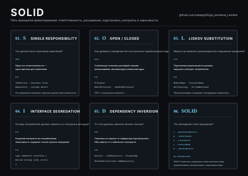

SOLID полезен как vocabulary для разговора о design, но не как checklist. Эти принципы помогают объяснять, почему определённая граница делает изменения дешевле и dependencies понятнее.

Single Responsibility означает одну ось ответственности и изменения. Это не означает «одна функция на файл» и не требует искусственного дробления. Важно понять, какие независимые причины могут заставить компонент измениться.

Open/Closed говорит о том, что стабильную policy желательно расширять новым behavior там, где boundary действительно стабильна, вместо постоянного переписывания уже устойчивого ядра. Это не означает запрет на изменение кода.

Liskov Substitution связан с контрактом. Если одна implementation заменяется другой, consumer не должен неожиданно получить несовместимую семантику. Поэтому два `JobRepository` должны одинаково трактовать например not found, valid input и error behavior в пределах общего contract.

Interface Segregation говорит, что consumer не должен зависеть от ненужных capabilities. Поэтому маленький `JobRepository` из нескольких методов часто лучше гигантского interface, содержащего экспорт, rebuild index, cache administration и десятки других операций.

Dependency Inversion говорит о направлении dependency. Высокоуровневая policy не должна напрямую зависеть от конкретной infrastructure detail. В Go это часто выражается consumer-side interface и constructor injection: `JobService` знает необходимое поведение repository, а конкретный PostgreSQL adapter подключается снаружи.

Главное — помнить, что SOLID не является причиной для создания сложной архитектуры. Сначала нужно найти реальную проблему изменения или зависимости, а затем применить подходящий принцип.

---

## 04B. DESIGN ENGINEERING

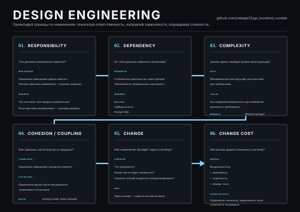

В практическом проектировании важнее не количество паттернов, а стоимость изменения. Сначала нужно определить, что должно изменяться вместе, а что должно изменяться независимо.

Cohesion отвечает на вопрос, насколько хорошо связанные вещи находятся вместе. Если `JobService` занимается созданием и изменением Job, это высокая cohesion. Если он одновременно рендерит Prometheus, кодирует JSON и переподключает Kafka, внутри него уже смешаны разные причины изменения.

Coupling показывает, насколько изменение одной части затрагивает другие. Если бизнес-правила напрямую знают о PostgreSQL, Kafka и Redis, стоимость изменения инфраструктуры становится частью стоимости изменения policy.

KISS требует минимальной конструкции, достаточной для требования. YAGNI напоминает не создавать capabilities, которые ещё не нужны. DRY относится прежде всего к дублированию знания: один факт или правило должен иметь одного владельца. Простое текстовое совпадение само по себе ещё не доказывает нарушение DRY.

Хорошая архитектурная граница уменьшает blast radius изменения. Если PostgreSQL меняется, должен измениться storage adapter и wiring, а не бизнес-правила. Если меняется HTTP protocol, изменяется transport layer. Если меняется business rule, изменение остаётся внутри соответствующей policy.

Поэтому design engineering можно свести к одной дисциплине: находить ось изменения, локализовать её, уменьшать dependency surface и не добавлять complexity без реального требования.

---

## 05A. DATA MODEL

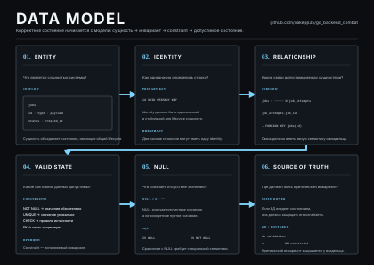

Когда состояние становится persistent, его нужно сначала смоделировать. В JobFlow сущность `Job` имеет identity и текущее состояние. Identity должна быть уникальной и устойчивой. Остальные поля описывают состояние этой конкретной сущности.

Здесь особенно важно различать domain state и database representation. В базе появляются tables, rows и columns, но смысл модели остаётся прежним: нужно определить допустимые состояния, связи и invariants.

Если у одной Job может быть много попыток выполнения, `job_attempts` становится отдельной сущностью. Это отношение один-ко-многим, которое база может выразить через foreign key. Такая модель лучше отражает отдельный lifecycle attempts и позволяет хранить произвольное количество запусков.

Database constraints — это исполняемые invariants. `PRIMARY KEY` защищает identity, `NOT NULL` запрещает отсутствие обязательного значения, `UNIQUE` защищает уникальность, `CHECK` ограничивает допустимые значения, а `FOREIGN KEY` сохраняет отношения между сущностями.

Go validation и database constraints не конкурируют. Go validation отвечает за удобный и ранний feedback на API boundary. Database constraints защищают authoritative state независимо от того, какой путь записи пришёл к базе.

Особое значение имеет `NULL`. Это не пустая строка и не ноль. Это отдельная SQL semantics отсутствующего или неизвестного значения, поэтому сравнение выполняется через `IS NULL` или `IS NOT NULL`, а не через `=`.

---

## 05B. SQL SCHEMA

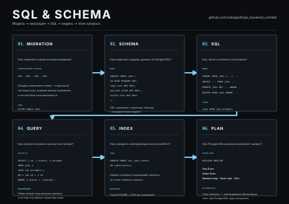

Когда модель определена, она должна стать воспроизводимой schema. Migration — это не просто SQL-файл, а versioned transition между двумя состояниями базы. Благодаря migrations schema можно создать с нуля, проверить в code review и одинаково применить в разных окружениях.

Goose помогает организовать эту историю. Каждая migration имеет понятный Up-переход и, когда rollback действительно поддерживается, соответствующий Down-переход. Важен сам принцип: schema changes должны быть частью versioned source of truth, а не зависеть от ручных действий администратора.

После создания schema начинается реальная работа с SQL. `INSERT` создаёт state, `SELECT` читает его, `UPDATE` изменяет, `DELETE` удаляет. Параметризованные queries отделяют SQL syntax от values и являются стандартной границей между application code и пользовательскими данными.

`JOIN` позволяет собирать связанные state из нескольких relations. `INNER JOIN` возвращает только matching rows, а `LEFT JOIN` сохраняет строки левой стороны даже при отсутствии соответствующей записи справа.

Indexes нужно создавать не «на важные поля», а под реальные access patterns. Index имеет стоимость storage и maintenance, поэтому вопрос всегда звучит так: какой запрос мы ускоряем и действительно ли planner должен для него использовать этот index.

`EXPLAIN` показывает выбранный execution plan. `EXPLAIN ANALYZE` идёт дальше и выполняет запрос, показывая фактические execution statistics. Поэтому database performance должна обсуждаться на основе наблюдаемого query behavior, а не интуиции.

---

## 05C. TRANSACTIONS & CONCURRENCY

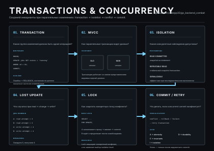

Transaction нужна тогда, когда несколько изменений образуют одну логическую state transition. Если запуск Job должен одновременно изменить её статус и создать Attempt, эти два действия должны либо оба зафиксироваться, либо оба быть отменены.

В конкурентной системе недостаточно просто использовать transaction. Нужно понимать, как несколько transactions взаимодействуют друг с другом. Классический пример — lost update. Две операции читают одно старое состояние, каждая рассчитывает новое, и одна запись уничтожает эффект другой.

Для таких случаев применяются row locks, например `FOR UPDATE`, conditional updates и соответствующий isolation level. `FOR UPDATE` позволяет явно защитить строку для последующего изменения. Это не глобальная блокировка базы, а целевая координация конкретного state.

PostgreSQL использует MVCC, благодаря чему concurrent transactions могут работать со snapshot-based представлениями данных. Но MVCC не отменяет необходимость locks и правильного transaction design. Isolation level определяет, какие наблюдения и conflicts допускаются между concurrent transactions.

ACID удобно помнить не как четыре абстрактных слова, а как четыре свойства transaction semantics. Atomicity отвечает за целостность group of changes. Consistency — за сохранение constraints и invariants. Isolation — за правила взаимодействия concurrent transactions. Durability — за сохранение committed state в пределах гарантий СУБД и её конфигурации.

Практический backend должен уметь не только начать transaction, но и корректно завершить её на всех путях: commit при успехе, rollback при ошибке, context propagation, bounded duration и понятное поведение при concurrency conflict.

---

## 06A. DISTRIBUTED MODEL

В локальной функции обычно можно получить довольно понятный результат: вызвали функцию и получили return. В distributed system между отправителем и получателем появляется network boundary, а вместе с ней latency, независимый lifecycle и partial failure.

Timeout — один из самых важных примеров. Истечение времени ожидания говорит, что инициатор не получил результат вовремя, но не доказывает, что remote operation не произошла. Система может уже изменить state, пока отправитель считает результат неизвестным.

Поэтому distributed systems должны уметь жить с unknown result. При network failure producer может знать только, что связь разорвалась. Он не знает, дошло ли сообщение, был ли выполнен effect и успел ли consumer зафиксировать результат.

Duplicate delivery — тоже нормальная часть модели. Например, consumer может выполнить database effect и упасть до commit offset. После restart message будет доставлено повторно. Это не обязательно bug брокера. Это следствие выбранной delivery semantics.

Ordering тоже имеет scope. В Kafka можно сохранить порядок внутри partition, но нельзя автоматически получить глобальный порядок всех messages во всём topic.

Основной принцип распределённого мышления поэтому такой: нельзя предполагать, что одна boolean-фраза `success` описывает всю систему. Нужно разделять состояние каждой boundary, понимать partial failure и заранее определять recovery semantics.

---

## 06B. DELIVERY & MESSAGING

Kafka или Redpanda дают нам асинхронную messaging boundary. Producer публикует event, broker хранит его в topic partition, consumer читает и фиксирует progress через offset. Такая архитектура позволяет разделить lifecycle producer и worker.

At-most-once означает, что повторная обработка не ожидается, но message может потеряться. At-least-once допускает duplicate, зато система проектируется так, чтобы message можно было безопасно повторно доставить. Для практического backend гораздо важнее уметь гарантированно пережить duplicate, чем пытаться сделать весь внешний мир exactly-once.

Offset отражает progress consumer. Если offset зафиксирован раньше effect и process аварийно завершился, message может быть потеряно. Если effect произошёл раньше offset commit, после crash возможен duplicate. Именно поэтому at-least-once естественно сочетается с idempotent processing.

Partition определяет область ordering и parallelism. Consumer group распределяет partitions между consumer instances. Число partitions ограничивает полезный уровень consumer parallelism в рамках группы, а внутренняя worker pool добавляет ещё один уровень ограничения.

Outbox решает другую проблему — связь database state и event intent. Job и `outbox_event` записываются одной PostgreSQL transaction. После commit relay доставляет event в Kafka. Если Kafka временно недоступна, event не исчезает. Но relay может упасть после publish и до отметки published, поэтому duplicate всё равно возможен.

Получается важная модель: transport обеспечивает delivery semantics, а application обеспечивает correctness effect. Нельзя путать эти две вещи.

---

## 06C. FAILURE & EFFECTS

После того как сообщение можно повторить, главным становится effect. Idempotent consumer должен быть устроен так, чтобы повтор одного logical event не создавал новый unwanted effect.

Для этого используется стабильный `event_id`, persistent deduplication state или условный state transition. Например, переход `pending → running` можно сделать условным через SQL `WHERE status = 'pending'`. После первого успешного перехода повторный вызов уже не соответствует условию.

Idempotency не означает, что запрос никогда не выполняется повторно. Она означает, что повтор не меняет итоговый business effect нежелательным образом. Поэтому особенно важна граница, внутри которой вместе фиксируются idempotency marker и authoritative state change.

Retry должен быть policy, а не автоматической реакцией на любое `error != nil`. Temporary unavailable, timeout или connection reset потенциально retryable. Invalid payload, permission denied и business invariant violation обычно требуют другого поведения.

Exponential backoff уменьшает частоту повторных попыток, а jitter не позволяет множеству клиентов одновременно повторять операции в одинаковые моменты. Retry должен быть bounded: нужны maximum attempts, общий deadline и terminal failure path.

Именно здесь проявляется зрелый distributed design. Мы не пытаемся убрать все failures. Мы делаем их поведение определённым: event можно повторить, effect безопасен, retry имеет предел, permanent failure попадает в понятное состояние, а результат можно наблюдать и восстановить.

---

## 07A. HTTP API

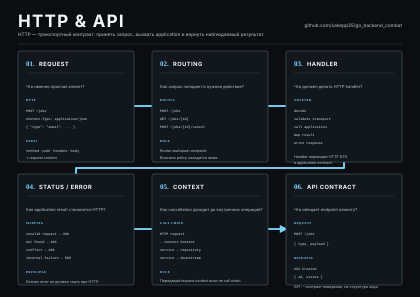

HTTP — внешний transport, а не внутренний domain model. Request содержит method, path, headers и body. Эти данные сначала преобразуются в application input, после чего business logic работает с собственными types и contracts.

Handler должен быть тонким. Его работа — принять request, выполнить transport-level parsing и validation, вызвать application use case и преобразовать result или error обратно в HTTP representation.

Это важно для error mapping. `ErrJobNotFound` не должен знать, что существует HTTP 404. Application error сохраняет свою собственную semantics, а HTTP adapter переводит её в status code. Аналогично validation может стать 400, conflict — 409, unexpected server failure — 500.

Context должен пройти от request до database, messaging и других downstream operations. Если client disconnects или deadline истекает, ненужная работа должна иметь возможность завершиться.

Хороший API contract определяется observable behavior: какие requests допустимы, что возвращается при success, какие status codes обозначают конкретные outcomes и как описываются errors. Внутреннее устройство handler может меняться без изменения этого внешнего contract.

---

## 07B. APPLICATION ARCHITECTURE

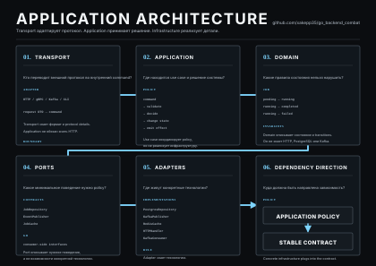

Когда система становится большой, удобно разделить transport, application, domain и infrastructure. Transport понимает HTTP или другой внешний protocol. Application знает use cases и координирует действия. Domain содержит state, invariants и business behavior. Infrastructure реализует работу с PostgreSQL, Kafka, Redis и другими внешними системами.

Application не должен знать concrete PostgreSQL или Kafka client. Он зависит только от нужного ему behavior через ports. Concrete adapters подключаются снаружи.

Например, `JobRepository` нужен потому, что application умеет сохранять Job, а не потому, что application должен знать SQL client. `EventPublisher` нужен потому, что use case хочет инициировать asynchronous effect, а не потому, что ему нужно знать конкретный Kafka library.

Composition root собирает весь dependency graph. Обычно это `main` или bootstrap package. Именно там создаются config, logger, database pool, Redis client, Kafka client, repositories, publishers, services, handlers и workers. Такой ownership делает lifecycle системы явным.

Эта архитектура не обязана иметь именно такие директории или package names. Важна dependency direction: policy не должна знать implementation detail, а technology adapters должны подключаться к стабильным application contracts.

---

## 07C. RUNTIME & CACHE

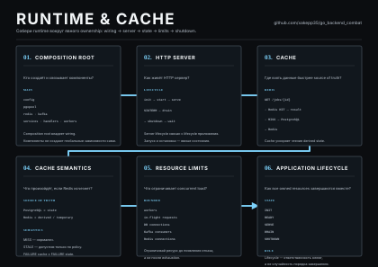

После проектирования компонентов возникает практический вопрос: кто создаёт и завершает всё это runtime graph. Composition root должен не только собрать dependencies, но и управлять их lifecycle. Server запускается, workers стартуют, pools открываются, а при shutdown новые операции перестают приниматься и resources корректно освобождаются.

Redis в JobFlow используется как derived state. PostgreSQL остаётся source of truth. Это означает, что потеря Redis не должна разрушить authoritative state системы.

Наиболее простая модель — cache-aside. Сначала читается Redis. При hit данные возвращаются сразу. При miss application читает PostgreSQL и может сохранить результат в Redis. TTL ограничивает срок жизни cached data.

Но cache требует своей semantics. Cached value может стать stale, Redis может быть недоступен, а массовый cache miss способен перегрузить PostgreSQL. Поэтому cache policy должна включать invalidation, TTL, resource limits и failure fallback.

Production runtime должен ограничивать ресурсы на всех слоях. Worker pool ограничивает application concurrency. DB pool ограничивает database concurrency. Redis и Kafka имеют собственные capacity limits. Queue и in-flight work также должны иметь bounds.

В результате runtime architecture — это не просто набор клиентов и goroutines. Это система управления ресурсами и lifecycle. Компоненты должны быть созданы владельцем, иметь понятные stop conditions, корректно завершаться и деградировать только в пределах заранее определённой policy.
