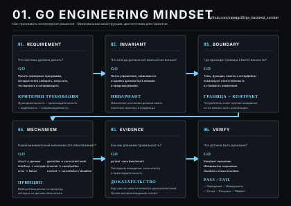

# Go Backend Combat — 01. ENGINEERING MINDSET

**Version:** 1.0.0  
**Topic:** Engineering Mindset  
**Format:** учебный материал ученика  
**Project:** JobFlow  
**Poster:** [01 — ENGINEERING MINDSET](../posters/01_ENGINEERING_MINDSET.svg)

---

# 1. Цель занятия

Научиться решать backend-задачи не от инструмента к задаче, а от требования к доказуемому результату.

Базовый инженерный цикл:

> **REQUIREMENT → INVARIANT → BOUNDARY → MECHANISM → EVIDENCE → VERIFY**

Каждый шаг отвечает на отдельный вопрос:

| Шаг | Вопрос |
|---|---|
| REQUIREMENT | Что система должна делать? |
| INVARIANT | Что всегда должно оставаться истинным? |
| BOUNDARY | Где проходит граница ответственности? |
| MECHANISM | Какой минимальный механизм это обеспечивает? |
| EVIDENCE | Как мы докажем правильность? |
| VERIFY | Что именно должно быть доказано? |



---

# 2. Главная инженерная установка

Не начинай с технологии.

Плохой порядок:

```text
interface
goroutine
Redis
Kafka
PostgreSQL
    ↓
пытаемся понять, зачем они нужны
````

Рабочий порядок:

```text
требование
    ↓
инвариант
    ↓
граница
    ↓
механизм
    ↓
доказательство
```

Основное правило:

> **Не защищай конкретный код. Защищай гарантию, которую код должен дать.**

---

# 3. REQUIREMENT

## Что система должна делать?

Требование должно описывать ожидаемое наблюдаемое поведение.

Пример для языка backend-разработки:

> Язык должен позволять писать серверные программы, которые можно собирать, запускать, тестировать и сопровождать с предсказуемыми затратами.

### Хорошее требование

Его можно проверить наблюдением, измерением или воспроизводимым сценарием.

### Плохое требование

> «Система должна быть удобной.»

Проблема: не определено, что именно считается удобством и как это проверить.

Уточнение:

```text
удобство
    ↓
наблюдаемые свойства
    ↓
проверяемые критерии
```

Например:

```text
время сборки
время запуска
тестируемость
предсказуемость поведения
устойчивость к изменениям
стоимость сопровождения
```

### Практика

Для JobFlow сформулируй требование к операции создания Job.

**Требование:**

> Пользователь может создать Job и получить её идентификатор.

Уточни его до проверяемой формы.

Что должно быть наблюдаемым?

```text
HTTP status
response body
persisted state
created Job ID
```

---

# 4. INVARIANT

## Что всегда должно оставаться истинным?

Инвариант — свойство системы или состояния, которое должно сохраняться во всех допустимых состояниях и после допустимых переходов.

Примеры JobFlow:

```text
Job имеет уникальный ID.

Job не существует без обязательного type.

Invalid Job не становится persisted valid state.

Переход состояния имеет допустимую причину.

Одна операция не должна создавать неконтролируемый повторный effect.
```

Важно:

> Инвариант должен сохраняться не только в happy path.

Пример:

```text
success path     → invariant сохранён
error path       → invariant сохранён
retry            → invariant сохранён
concurrent call  → invariant сохранён
```

### Практика

Для `POST /transfer` с переводом 100 ₽:

Назови минимум три инварианта.

<details><summary>Подсказка</summary>Смотри на деньги до и после операции. Подумай о partial failure, retry и concurrency.</details>

<details><summary>Ожидаемый ответ</summary>

Например:

* деньги не создаются и не исчезают;
* изменение обоих счетов происходит атомарно;
* повтор операции не создаёт нежелательный повторный перевод;
* конкурентные операции не нарушают ограничения состояния.

</details>

---

# 5. BOUNDARY

## Где проходит граница ответственности?

Граница нужна для локализации:

* ответственности;
* изменений;
* зависимостей;
* знания о деталях реализации.

Не начинай с названий каталогов.

Сначала спроси:

> **Что должно изменяться независимо от чего?**

Для backend:

```text
HTTP
business policy
database
external service
messaging
observability
```

могут иметь разные причины изменения.

В Go границы выражаются через:

```text
functions
types
packages
interfaces
```

### Пример

```text
JobService
    ↓
PostgreSQL
```

Если `JobService` напрямую знает конкретный PostgreSQL client, изменение storage распространяется вверх.

Лучше:

```text
JobService
    ↓
JobRepository
    ↑
PostgresRepository
```

Теперь:

```text
policy
   ↓
stable contract
   ↑
infrastructure detail
```

### Практика

В JobFlow ответь:

> Завтра PostgreSQL заменяется другой БД. Что должно измениться?

<details><summary>Подсказка</summary>Раздели business policy и storage implementation.</details>

<details><summary>Ожидаемый ответ</summary>

В идеале меняется infrastructure implementation и wiring. Business rules и потребители стабильного repository contract остаются неизменными.

</details>

---

# 6. MECHANISM

## Какой минимальный механизм обеспечивает гарантию?

Механизм выбирается **после** определения требования и инварианта.

Не:

```text
нужен interface → потому что SOLID
```

А:

```text
нужно локализовать dependency
        ↓
нужен минимальный contract
        ↓
interface
```

---

## Interface

Вопрос:

> Зачем Go-программе interface?

Ответ:

> Чтобы потребитель зависел от нужного поведения, а не от конкретной реализации.

Пример:

```go
type JobRepository interface {
	Get(ctx context.Context, id string) (Job, error)
	Add(ctx context.Context, job Job) error
}
```

---

## Goroutine

Вопрос:

> Зачем goroutine?

Необходим сначала ответ на проблему:

```text
есть независимая concurrent work
```

После этого:

```go
go process(job)
```

Goroutine — механизм конкурентного выполнения.

---

## Channel

Вопрос:

> Зачем channel?

Когда concurrent operations должны:

```text
передавать значения
передавать сигналы
координировать работу
```

может использоваться channel.

---

## Context

Вопрос:

> Зачем `context.Context`?

Типичный backend flow:

```text
HTTP request
    ↓
context.Context
    ↓
service
    ↓
repository
```

Context используется для:

```text
cancellation
deadline
request-scoped metadata
```

---

## Практика

Для каждого механизма назови исходную проблему.

| Механизм          | Какую проблему решает? |
| ----------------- | ---------------------- |
| `interface`       | ?                      |
| `goroutine`       | ?                      |
| `channel`         | ?                      |
| `context.Context` | ?                      |

Критерий:

> Хороший ответ начинается не с названия API, а с проблемы и требуемой гарантии.

---

# 7. EVIDENCE

## Как мы докажем правильность?

Фраза:

> «Всё работает.»

не является доказательством.

Нужен воспроизводимый сигнал.

В Go:

```bash
go test ./...
```

проверяет ожидаемое поведение.

```bash
go test -race ./...
```

помогает обнаруживать data races.

Benchmarks:

```bash
go test -bench=. ./...
```

позволяют измерять производительность.

В production evidence дают:

```text
logs
metrics
traces
health checks
observed failures
```

---

## Пример

Предположим, endpoint работает в happy path.

Недостаточно проверить:

```text
POST /jobs → 201
```

Нужно проверить также:

```text
invalid request
repository failure
duplicate operation
timeout
concurrent request
shutdown
```

### Практика

Назови evidence для:

| Требование                | Evidence |
| ------------------------- | -------- |
| корректное поведение      | ?        |
| отсутствие data race      | ?        |
| производительность        | ?        |
| отказ внешней зависимости | ?        |

<details><summary>Ожидаемый ответ</summary>

```text
behavior       → go test
race           → go test -race
performance    → benchmark
failure        → failure test / integration test / observable runtime behavior
```

</details>

---

# 8. VERIFY

## Что должно быть доказано перед завершением работы?

Проверяется не только наличие кода.

Минимальный verification set:

```text
contract выполнен
invariants сохранены
dependencies работают как задумано
errors имеют допустимую семантику
failures имеют допустимое поведение
resources bounded
result observable
```

Формула:

> **Commit кода ≠ доказательство корректности системы.**

---

# 9. Happy Path недостаточен

Инженерное решение проверяется несколькими сценариями.

```text
HAPPY
  ↓
ERROR
  ↓
TIMEOUT
  ↓
RETRY
  ↓
CONCURRENCY
  ↓
SHUTDOWN
```

Например:

```text
POST /jobs
```

не означает только:

```text
request → 201
```

Нужно понимать:

```text
request
 ↓
validation
 ↓
state change
 ↓
external effect
 ↓
response
```

и поведение при каждом отказе.

---

# 10. Первый инженерный кейс

## `POST /transfer`

Есть:

```text
Account A
Account B
```

Нужно перевести:

```text
100 ₽
```

### Требование

Перевод должен быть корректно выполнен.

### Уточнение требования

Определить:

```text
успешный HTTP result
persisted state
atomicity
duplicate behavior
concurrent behavior
failure behavior
```

---

## Вопрос 1

Какие инварианты должны сохраняться?

<details><summary>Подсказка</summary>Что нельзя потерять или создать?</details>

<details><summary>Ответ</summary>

* деньги не создаются и не уничтожаются;
* изменение A и B выполняется атомарно;
* повтор операции не создаёт нежелательный повторный перевод;
* конкурентные операции не нарушают баланс и другие ограничения.

</details>

---

## Вопрос 2

Где проходит boundary?

<details><summary>Подсказка</summary>Раздели HTTP transport, business policy и persistence.</details>

<details><summary>Ответ</summary>

```text
HTTP
 ↓
application/business policy
 ↓
persistence
```

Transport не должен владеть business rules, а application policy не должна знать конкретную DB implementation.

</details>

---

## Вопрос 3

Какой механизм нужен для атомарного изменения двух счетов?

<details><summary>Ответ</summary>

Database transaction.

</details>

---

## Вопрос 4

Как проверить concurrent transfers?

<details><summary>Подсказка</summary>Одна операция не должна быть единственным тестом.</details>

<details><summary>Ответ</summary>

Запустить конкурентные операции, проверить итоговое состояние, инварианты, отсутствие lost update и корректность transaction semantics.

</details>

---

# 11. JobFlow: первая инженерная модель

На курсе всё дальнейшее обучение строится вокруг JobFlow.

Базовая модель:

```text
Job
 ↓
Repository
 ↓
Service
```

Далее система будет расширяться:

```text
Job
 ↓
Concurrency
 ↓
HTTP
 ↓
PostgreSQL
 ↓
Kafka
 ↓
Redis
 ↓
Production runtime
```

Каждая новая конструкция появляется из конкретного требования.

---

# 12. Инженерный цикл JobFlow

Для любой новой возможности JobFlow используй один и тот же шаблон.

### Requirement

```text
Что пользователь хочет получить?
```

### Invariant

```text
Что не должно сломаться?
```

### Boundary

```text
Какая часть системы отвечает за это?
```

### Mechanism

```text
Какой минимальный механизм обеспечивает гарантию?
```

### Evidence

```text
Как проверить?
```

### Verify

```text
Можно ли считать результат доказанно корректным?
```

---

# 13. Практическое задание

Спроектировать:

```text
POST /jobs
```

не реализуя пока весь HTTP stack.

Определить:

### Requirement

Что получает пользователь?

### Invariant

Что должно быть истинным после создания?

### Boundary

Что отвечает за HTTP?

Что отвечает за Job policy?

Что отвечает за persistence?

### Mechanism

Как создаётся Job?

Как передаётся dependency?

Как обрабатывается error?

### Evidence

Какие tests нужны?

---

# 14. Checkpoint

Перед переходом к Go необходимо уметь ответить без подсказки.

### 1. Что такое requirement?

<details><summary>Ответ</summary>Ожидаемое поведение системы, сформулированное так, чтобы его можно было проверить.</details>

### 2. Что такое invariant?

<details><summary>Ответ</summary>Свойство состояния или поведения, которое должно сохраняться в допустимых сценариях.</details>

### 3. Зачем нужна boundary?

<details><summary>Ответ</summary>Чтобы локализовать ответственность, изменения и зависимости.</details>

### 4. Когда появляется interface?

<details><summary>Ответ</summary>Когда реальная граница требует contract между consumer и implementation.</details>

### 5. Что такое evidence?

<details><summary>Ответ</summary>Наблюдаемый, воспроизводимый сигнал, подтверждающий определённое свойство системы.</details>

### 6. Почему unit tests не доказывают production readiness?

<details><summary>Ответ</summary>Они проверяют только покрытые сценарии и не гарантируют автоматически нагрузочную устойчивость, корректность всех concurrency interactions, отказоустойчивость и реальные внешние эффекты.</details>

---

# 15. Инженерный шаблон мышления

Используй этот шаблон перед любой серьёзной реализацией:

```text
REQUIREMENT
Что система должна делать?

INVARIANT
Что всегда должно оставаться истинным?

BOUNDARY
Что изменяется независимо от чего?

MECHANISM
Какой минимальный механизм обеспечивает гарантию?

EVIDENCE
Как мы это проверим?

VERIFY
Что именно считается PASS / FAIL?
```

---

# 16. Правила курса

### Правило 1

> **Сначала поведение, потом механизм.**

### Правило 2

> **Сначала invariant, потом implementation.**

### Правило 3

> **Изменение должно иметь понятный blast radius.**

### Правило 4

> **Ошибка и отказ — часть нормальной модели системы.**

### Правило 5

> **Успешный commit не равен доказанному успеху всей системы.**

### Правило 6

> **Критическое утверждение должно иметь evidence.**

---

# 17. Практика перед следующим занятием

Для JobFlow подготовить проектное описание первой версии:

```text
1. Что такое Job?
2. Какие поля входят в state?
3. Какие invariants существуют?
4. Какие операции разрешены?
5. Какие ошибки возможны?
6. Какие зависимости потребуются?
7. Какой самый простой repository нужен для первой реализации?
8. Как проверить behavior?
```

Не проектировать заранее PostgreSQL, Kafka, Redis или сложную архитектуру.

Сначала определить:

```text
state
behavior
contract
evidence
```

---

# 18. Домашнее задание

## Задание 1 — Job model

Определить:

```go
type Job struct {
	ID        string
	Type      string
	Payload   []byte
	Status    JobStatus
	CreatedAt time.Time
}
```

Определить допустимые статусы:

```text
pending
running
completed
failed
```

---

## Задание 2 — State transitions

Определить допустимые переходы:

```text
pending   → running
running   → completed
running   → failed
```

Для каждого перехода определить:

```text
условие
изменение state
ошибка при недопустимом переходе
```

---

## Задание 3 — Validation

Определить validation для:

```text
ID
Type
Payload
Status
```

---

## Задание 4 — Evidence

Написать tests для:

```text
valid Job
invalid Job
pending → running
running → completed
running → failed
invalid state transition
```

Запустить:

```bash
go test ./...
go vet ./...
```

---

# 19. Acceptance Criteria

## PASS

Материал считается освоенным, если можно без подсказки:

```text
сформулировать requirement
        ↓
назвать invariant
        ↓
провести boundary
        ↓
выбрать минимальный mechanism
        ↓
назвать evidence
        ↓
определить PASS / FAIL
```

И применить эту последовательность к новой backend-задаче.

---

# 20. Главная мысль

> **Инженерное решение — это не выбранный инструмент. Это связь между требованием, инвариантом, границей, механизмом и доказательством.**

В Go Backend Combat эта модель используется на протяжении всего курса:

```text
ENGINEERING MINDSET
       ↓
GO
       ↓
CONCURRENCY
       ↓
DESIGN
       ↓
DATA
       ↓
DISTRIBUTED
       ↓
ARCHITECTURE
```

Каждый следующий урок добавляет новый класс проблем, но способ мышления остаётся тем же.
