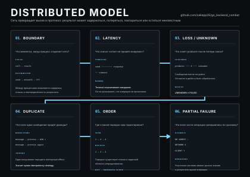
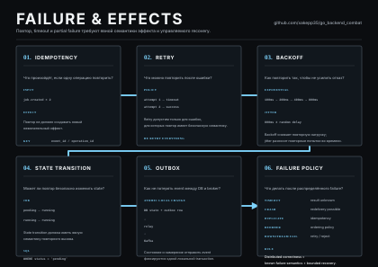
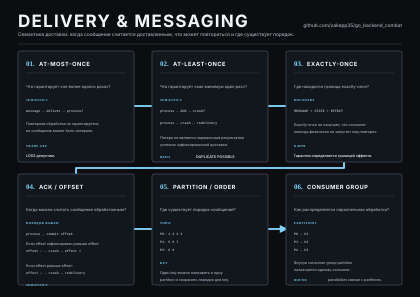

# Go Backend Combat — 06. DISTRIBUTED SYSTEMS

**Version:** 1.0.0
**Topic:** Distributed Systems
**Format:** Дидактический материал ученика — Kafka/Redpanda, delivery semantics, Outbox, idempotency и distributed failure
**Project:** JobFlow
**Duration:** 120 минут
**Prerequisite:** `05_DATA.md`

Плакаты:

* [06A — Distributed Model](../posters/06A_DISTRIBUTED_MODEL.svg)
* [06B — Delivery & Messaging](../posters/06B_DELIVERY_MESSAGING.svg)
* [06C — Failure & Effects](../posters/06C_FAILURE_EFFECTS.svg)

---

# 1. Цель занятия

JobFlow переходит от локальной системы к распределённому взаимодействию:

```text
PostgreSQL
    │
    ▼
Outbox
    │
    ▼
Kafka / Redpanda
    │
    ▼
Workers
    │
    ▼
PostgreSQL
```

Теперь между компонентами появляются новые failure modes:

```text
delay
loss
duplicate
reorder
partial failure
unknown result
```

Главная идея:

> **Распределённая система должна иметь явную семантику доставки, повторов и внешнего эффекта.**

---

# 2. Distributed Model



Локальный вызов:

```text
call
 ↓
result
```

Distributed interaction:

```text
send
 ↓
network
 ↓
?
```

Между `send` и `result` могут появиться:

```text
latency
loss
duplicate
partial failure
unknown result
```

---

# 3. Boundary

На distributed boundary появляются:

```text
process
network
independent lifecycle
independent state
```

Поэтому:

> **Распределённый вызов нельзя автоматически воспринимать как обычный function call.**

Пример:

```text
Producer
   │
   │ message
   ▼
Consumer
```

Producer не контролирует полностью:

```text
delivery time
consumer state
network state
effect completion
```

---

# 4. Latency

Timeout означает:

> **Мы больше не готовы ждать результат.**

Timeout не означает автоматически:

> **Операция не произошла.**

Например:

```text
producer
   │
   │ request
   ▼
consumer
   │
   │ commit
   ▼
state

producer
   │
   └── timeout
```

Producer может не знать, произошёл ли effect.

Поэтому:

```text
timeout
≠
operation did not happen
```

---

# 5. Unknown Result

После timeout возможны разные реальные состояния:

```text
message never arrived
message arrived but processing not started
processing happened
effect happened
effect happened and response was lost
```

Для producer все они могут выглядеть одинаково:

```text
no response
```

Следствие:

> **Unknown result — нормальная проблема distributed systems.**

---

# 6. Duplicate Delivery

Сценарий:

```text
message
  ↓
process
  ↓
ACK ✗
  ↓
message again
```

Duplicate может быть нормальным следствием выбранной delivery semantics.

Проблема возникает, если effect не выдерживает повтор.

Например:

```text
charge card
send email
create payment
increment counter
```

могут оказаться выполненными дважды.

Поэтому delivery semantics и effect semantics должны рассматриваться вместе.

---

# 7. Ordering

Нельзя говорить:

> **Kafka всегда сохраняет глобальный порядок сообщений.**

Порядок определяется конкретной областью упорядочивания.

Для topic с partitions:

```text
topic
 ├── P0
 ├── P1
 └── P2
```

ordering гарантируется внутри partition.

Например:

```text
job-42 → partition 1
```

Если события одной Job используют один и тот же key, они могут сохранять порядок внутри соответствующей partition.

Глобального порядка между разными partitions нет.

---

# 8. Partial Failure

Одна из основных distributed problems:

```text
DB COMMIT ✓
NETWORK     X
CLIENT      ?
```

Database state уже изменён, но другая сторона не знает об этом или не получила effect.

Это:

> **Partial failure.**

Систему нельзя описывать одним boolean:

```text
success / failure
```

Необходимо понимать состояние каждой boundary.

---

# 9. Наивный DB → Kafka flow

Плохой вариант:

```go
func (s *JobService) Create(
	ctx context.Context,
	job Job,
) error {
	if err := s.repo.Add(ctx, job); err != nil {
		return err
	}

	return s.publisher.Publish(
		ctx,
		JobCreated{JobID: job.ID},
	)
}
```

Проблема:

```text
PostgreSQL
    +
Kafka
```

не имеют одной локальной transaction boundary.

---

# 10. Failure: DB commit → Kafka failure

```text
DB commit ✓
Kafka publish ✗
```

Получаем:

```text
Job exists
event missing
```

Worker может никогда не узнать о создании Job.

---

# 11. Failure: Kafka publish → DB failure

```text
Kafka publish ✓
DB commit ✗
```

Worker получил event о состоянии, которое не было зафиксировано.

Это ещё один вариант partial failure.

---

# 12. Outbox



Основная идея:

```text
PostgreSQL transaction
   ├── jobs
   └── outbox_events
          │
          ▼
        relay
          │
          ▼
        Kafka
```

Вместо:

```text
DB commit
   ↓
Kafka publish
```

получаем:

```text
BEGIN
 ↓
change state
 ↓
record event intent
 ↓
COMMIT
```

После commit отдельный relay занимается delivery.

---

# 13. Что решает Outbox

Outbox делает атомарными:

```text
local state change
+
message intent
```

в рамках одной PostgreSQL transaction.

Если insert Job прошёл, а insert Outbox failed:

```text
ROLLBACK
```

Если оба прошли:

```text
COMMIT
```

Получаем:

```text
state exists
+
intent exists
```

---

# 14. Что Outbox не решает

Outbox не гарантирует, что Kafka publish никогда не повторится.

Relay может:

```text
publish Kafka ✓
crash
mark published ✗
```

После восстановления relay снова увидит event как непомеченный и опубликует его ещё раз.

Получаем:

```text
duplicate delivery
```

Поэтому:

> **Outbox требует idempotent downstream processing.**

---

# 15. Outbox Schema

Минимальная таблица:

```sql
CREATE TABLE outbox_events (
    id uuid PRIMARY KEY,
    event_type text NOT NULL,
    aggregate_id uuid NOT NULL,
    payload jsonb NOT NULL,
    created_at timestamptz NOT NULL,
    published_at timestamptz
);
```

Основные поля:

```text
id
    identity event

event_type
    semantic type

aggregate_id
    Job / aggregate identity

payload
    event data

created_at
    creation time

published_at
    delivery state
```

---

# 16. Outbox Transaction

Создание Job:

```text
BEGIN

INSERT INTO jobs (...)

INSERT INTO outbox_events (...)

COMMIT
```

Если второй insert не прошёл:

```text
ROLLBACK
```

Оба изменения отменяются.

Если commit успешен:

```text
Job state exists
+
event intent exists
```

---

# 17. Delivery Semantics



Основные модели:

```text
AT-MOST-ONCE
AT-LEAST-ONCE
EXACTLY-ONCE
```

---

# 18. At-most-once

> **Сообщение обрабатывается не более одного раза, но может быть потеряно.**

Условно:

```text
delivery
 ↓
process
 ↓
progress recorded early
```

Если после фиксации progress произойдёт crash до effect:

```text
message
    ↓
lost
```

---

# 19. At-least-once

> **Сообщение может быть доставлено повторно.**

Сценарий:

```text
process
 ↓
effect ✓
 ↓
offset commit ✗
 ↓
crash
 ↓
redelivery
```

Получаем:

```text
same message
    ↓
second processing
```

Это нормальная семантика.

Она требует:

> **Idempotent consumer.**

---

# 20. Exactly-once

Не следует говорить:

> «Kafka гарантирует exactly-once для любой операции.»

Exactly-once зависит от границы, внутри которой реально фиксируются:

```text
message progress
+
state
+
effect
```

Если внешний effect находится за пределами этой atomic boundary, транспортная гарантия сама по себе не превращает его в exactly-once effect.

Поэтому нужно отдельно определить:

```text
delivery semantics
+
effect semantics
```

---

# 21. Offset / ACK

Небезопасный порядок:

```text
commit offset
    ↓
process
```

Если consumer падает после offset commit:

```text
message considered processed
effect missing
```

В другом порядке:

```text
process
 ↓
crash
 ↓
no offset commit
 ↓
redelivery
```

получаем duplicate.

Для JobFlow это предпочтительнее при условии idempotent effect.

---

# 22. Idempotency

Idempotent operation:

> **Повторение логической операции не создаёт новый нежелательный effect.**

Для event:

```text
event_id
   ↓
processed_events
```

Пример:

```sql
CREATE TABLE processed_events (
    event_id uuid PRIMARY KEY,
    processed_at timestamptz NOT NULL
);
```

`event_id` становится idempotency identity.

---

# 23. Idempotency Invariant

Нужно обеспечить:

> **Один логический event не должен создавать более одного требуемого business effect.**

Пример:

```text
event-42
    ↓
process
    ↓
state change
```

Повтор:

```text
event-42
    ↓
already processed
    ↓
no second effect
```

---

# 24. Idempotency через State Transition

Иногда отдельная deduplication table не обязательна.

Например:

```sql
UPDATE jobs
SET status = 'running'
WHERE id = $1
  AND status = 'pending';
```

Первый вызов:

```text
pending → running
```

Повтор:

```text
running
```

условие не выполняется.

Это делает конкретный state transition повторно безопасным.

Но:

> **Idempotency одного state transition не делает автоматически идемпотентными другие external effects.**

---

# 25. Partition Key

Kafka topic:

```text
job.events
 ├── P0
 ├── P1
 └── P2
```

Использование:

```text
key = job.ID
```

позволяет связать события одной Job с одной partition.

Это важно, если порядок:

```text
pending → running → completed
```

имеет значение.

Но:

> **Ordering между разными partitions не гарантируется.**

---

# 26. Consumer Group

Например:

```text
P0 → Worker A
P1 → Worker B
P2 → Worker C
```

Если:

```text
partitions = 3
workers = 100
```

в одной consumer group не все 100 consumers смогут одновременно читать уникальную partition.

Следовательно, consumer parallelism ограничивается:

```text
partition count
+
consumer group topology
+
internal worker concurrency
```

---

# 27. Retry

Timeout не означает автоматически:

> «Повторить.»

Сначала необходимо определить:

```text
retryable?
safe to repeat?
bounded?
```

Примеры потенциально retryable failures:

```text
temporary unavailable
connection reset
transient timeout
```

Потенциально non-retryable:

```text
invalid payload
permission denied
business invariant violation
```

Конкретная policy зависит от контракта.

---

# 28. Exponential Backoff

Простейшая схема:

```text
100ms
  ↓
200ms
  ↓
400ms
  ↓
800ms
  ↓
...
```

Backoff уменьшает вероятность retry storm.

Без него:

```text
failure
 ↓
retry immediately
 ↓
failure
 ↓
retry immediately
 ↓
...
```

может дополнительно перегружать уже деградировавший downstream.

---

# 29. Jitter

Если множество consumers одновременно повторяют:

```text
100ms
200ms
400ms
```

они могут синхронизироваться.

Jitter добавляет небольшую случайную вариацию к задержке.

Цель:

> **Развести повторные попытки во времени.**

---

# 30. Bounded Recovery

Recovery не должна быть бесконечной.

Нужно определить:

```text
max attempts
max delay
timeout
backoff
dead-letter / manual recovery policy
```

Условная модель:

```text
failure
 ↓
retry 1
 ↓
retry 2
 ↓
retry 3
 ↓
stop / DLQ / manual recovery
```

---

# 31. JobFlow Distributed Architecture

Целевая схема:

```text
                   HTTP API
                       │
                       ▼
                  JobService
                       │
                       ▼
                  PostgreSQL
                   /       \
                  /         \
                jobs       outbox
                              │
                              ▼
                           relay
                              │
                              ▼
                       Kafka / Redpanda
                              │
                 ┌────────────┼────────────┐
                 ▼            ▼            ▼
                W1           W2           W3
                 │            │            │
                 └────────────┼────────────┘
                              ▼
                         PostgreSQL
                              │
                       idempotent state
```

---

# 32. Полный lifecycle event

```text
POST /jobs
    ↓
validate
    ↓
change Job state
    ↓
INSERT outbox event
    ↓
COMMIT
    ↓
relay
    ↓
Kafka
    ↓
consumer
    ↓
dedup / idempotency
    ↓
state transition
    ↓
commit offset
```

---

# 33. Failure Matrix

| Failure                      | Possible result          | Основной механизм                |
| ---------------------------- | ------------------------ | -------------------------------- |
| Kafka unavailable            | event остаётся в outbox  | retry + backoff                  |
| relay crash after publish    | duplicate                | idempotent consumer              |
| consumer crash before effect | redelivery               | at-least-once                    |
| consumer crash after effect  | duplicate                | idempotency                      |
| timeout                      | unknown result           | retry policy + idempotency       |
| temporary DB failure         | incomplete processing    | bounded retry                    |
| invalid message              | permanent failure        | reject / DLQ                     |
| wrong ordering               | invalid state transition | partition key + state validation |

---

# 34. Практическое задание

Собрать для JobFlow:

```text
PostgreSQL
    ↓
Outbox
    ↓
Relay
    ↓
Kafka / Redpanda
    ↓
Consumer
    ↓
Worker Pool
    ↓
Idempotent state transition
```

Основной flow:

```text
Create Job
    ↓
persist Job
    ↓
persist event
    ↓
relay event
    ↓
publish
    ↓
consume
    ↓
process
    ↓
persist effect
```

---

# 35. Failure Drills

## Сценарий 1

Relay опубликовал message:

```text
Kafka publish ✓
outbox mark ✗
```

Что произойдёт?

<details><summary>Ответ</summary>Следующий relay может опубликовать тот же event повторно.</details>

Что должно защитить систему?

<details><summary>Ответ</summary>Idempotent consumer / deduplication.</details>

---

## Сценарий 2

Consumer записал state:

```text
DB effect ✓
offset commit ✗
```

и упал.

Что произойдёт?

<details><summary>Ответ</summary>Message может быть доставлено повторно.</details>

Это допустимо?

<details><summary>Ответ</summary>Да, если effect идемпотентен.</details>

---

## Сценарий 3

Kafka недоступна 30 секунд.

Что делает relay?

<details><summary>Ответ</summary>Оставляет event в outbox и использует bounded retry/backoff. Event не должен исчезать из-за временной недоступности broker.</details>

---

## Сценарий 4

Consumer получает один и тот же `event_id` дважды.

Что происходит?

<details><summary>Ответ</summary>Первый delivery создаёт effect, второй распознаётся как duplicate и не должен создавать второй business effect.</details>

---

## Сценарий 5

Получен invalid payload.

Нужно ли повторять бесконечно?

<details><summary>Ответ</summary>Нет. Ошибка должна классифицироваться как non-retryable или направляться в отдельную recovery/DLQ policy.</details>

---

# 36. Checkpoint

### Что такое distributed system?

<details><summary>Ответ</summary>Система из независимых компонентов, взаимодействующих через границы, где latency, failure и partial knowledge являются частью поведения.</details>

### Почему timeout не означает failure?

<details><summary>Ответ</summary>Timeout означает окончание ожидания результата. Операция могла завершиться на удалённой стороне.</details>

### Что такое partial failure?

<details><summary>Ответ</summary>Часть распределённой операции завершилась, а другая часть нет или не знает результата.</details>

### Что такое at-most-once?

<details><summary>Ответ</summary>Обработка не более одного раза, но потеря возможна.</details>

### Что такое at-least-once?

<details><summary>Ответ</summary>Повторная доставка возможна, поэтому consumer должен быть устойчив к duplicate.</details>

### Что такое exactly-once?

<details><summary>Ответ</summary>Гарантия, которая имеет смысл только относительно определённой atomic boundary; нельзя автоматически распространять её на произвольные external effects.</details>

### Что такое idempotency?

<details><summary>Ответ</summary>Повтор логической операции не создаёт новый нежелательный effect.</details>

### Что такое Outbox?

<details><summary>Ответ</summary>Паттерн, при котором state change и message intent фиксируются одной локальной transaction, а отдельный relay доставляет event в broker.</details>

### Что такое retry?

<details><summary>Ответ</summary>Повтор операции по заранее определённой policy при допустимом transient failure.</details>

### Зачем backoff?

<details><summary>Ответ</summary>Чтобы retries не усиливали нагрузку на деградировавшую систему.</details>

### Зачем jitter?

<details><summary>Ответ</summary>Чтобы разнести массовые retries во времени.</details>

### Зачем partition key?

<details><summary>Ответ</summary>Чтобы определить область ordering и привязать связанные events к одной partition.</details>

---

# 37. Домашнее задание — JobFlow v4

Цель:

> **Сделать Kafka/Redpanda частью реального JobFlow и самостоятельно проверить его failure semantics.**

## A. Outbox

Добавить:

```text
outbox_events
```

с полями:

```text
id
event_type
aggregate_id
payload
created_at
published_at
```

Создавать `JobCreated` в той же transaction, что и Job.

---

## B. Relay

Создать отдельный component:

```text
outbox relay
```

Flow:

```text
read unpublished
    ↓
publish Kafka
    ↓
mark published
```

Требования:

```text
context cancellation
bounded polling
retry
backoff
graceful shutdown
```

---

## C. Kafka / Redpanda

Поднять broker.

Создать topic:

```text
job.events
```

Использовать:

```text
key = job.ID
```

Проверить ordering для событий одной Job.

---

## D. Consumer

Создать consumer group:

```text
job-workers
```

Pipeline:

```text
read event
   ↓
validate
   ↓
idempotency check
   ↓
process
   ↓
state transition
   ↓
commit progress
```

---

## E. Idempotency

Добавить:

```text
processed_events
```

Например:

```sql
CREATE TABLE processed_events (
    event_id uuid PRIMARY KEY,
    processed_at timestamptz NOT NULL
);
```

Повтор одного `event_id` не должен создавать второй business effect.

---

## F. Failure Injection

Проверить минимум:

```text
Kafka unavailable
relay crash after publish
consumer crash after DB effect
duplicate event
downstream timeout
```

Для каждого сценария записать:

```text
Observed
Expected
Recovery
Verification
```

---

## G. Retry

Определить:

```text
max attempts
backoff
jitter
retryable errors
non-retryable errors
```

Retry должен быть bounded.

---

# 38. Verification

Запустить:

```bash
go test ./...
go test -race ./...
go vet ./...
```

Проверить:

```text
outbox atomicity
duplicate handling
idempotent consumer
retry policy
partition ordering
cancellation
shutdown
```

---

# 39. Acceptance Criteria

## PASS

Ученик:

* понимает partial failure;
* понимает `timeout ≠ operation did not happen`;
* объясняет at-most-once / at-least-once;
* аккуратно объясняет exactly-once;
* понимает partition и ordering;
* понимает consumer group;
* реализует Outbox;
* реализует relay;
* публикует события в Kafka/Redpanda;
* реализует consumer;
* имеет idempotency strategy;
* имеет retry/backoff policy;
* переживает duplicate;
* ограничивает recovery;
* корректно завершает relay и consumer;
* может объяснить failure semantics каждого участка pipeline.

---

# 40. Итоговая mental model

Распределённый JobFlow:

```text
LOCAL STATE
     ↓
TRANSACTION
     ↓
OUTBOX
     ↓
BROKER
     ↓
DELIVERY
     ↓
DUPLICATE
     ↓
IDEMPOTENCY
     ↓
EFFECT
     ↓
VERIFY
```

Главная формула:

> **Distributed correctness = explicit delivery semantics + idempotent effects + bounded recovery.**
